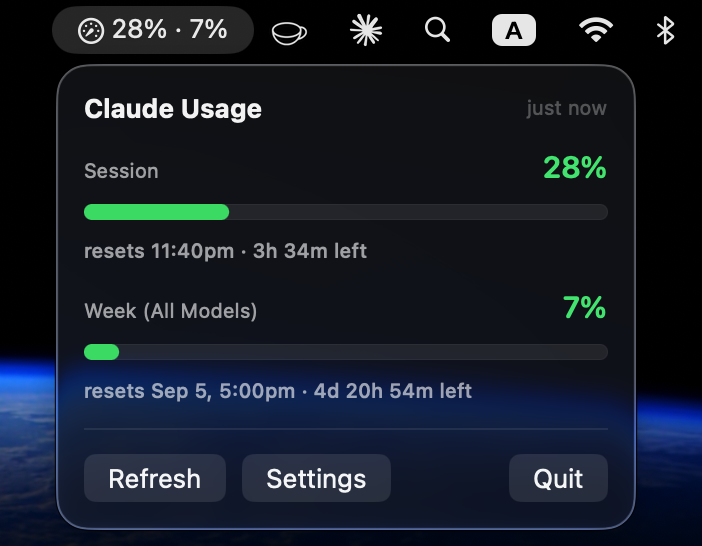

# Claude Usage

A macOS Notification Center widget showing your **current session** and
**current week** limits — percentage used and reset time for each.



The menu bar carries the same two numbers and is where the app is driven from:
refresh, settings, quit. On the desktop the widget shows them side by side:

```
SESSION                 53%          WEEK                    27%
██████████████░░░░░░░░░░             ██████░░░░░░░░░░░░░░░░░░
resets 9:19pm · 1h 24m left          resets Aug 29 at 4:59pm
```

## Where the numbers come from

From `claude -p "/usage"`, which is the same thing `/usage` shows inside a
session:

```
Current session: 48% used · resets Aug 28 at 9:20pm (Europe/London)
Current week (all models): 27% used · resets Aug 29 at 5pm (Europe/London)
```

Those percentages come from the server and exist nowhere on disk. They cost
**$0.0000 and 0 tokens** to fetch — it is a quota lookup, not an inference
request — and the call takes about two seconds.

> An earlier version of this computed everything from the transcripts in
> `~/.claude/projects` and reconstructed the 5-hour window locally. That is
> worth avoiding: the local files can only give you token counts, there is no
> published ceiling to turn those into a percentage, and the reconstructed reset
> time was consistently a few minutes off the real one.

## How it works

```
claude -p "/usage"   ← ~2s, 0 tokens, needs network
        │
        ▼
ClaudeUsage.app  (menu bar agent, NOT sandboxed — it spawns a process)
        │
        │  snapshot.json → widget's container
        ▼
ClaudeUsageWidget.appex  (sandboxed, as macOS requires)
```

A widget extension is sandboxed and cannot spawn processes, so the app does the
fetching on a timer, writes a small JSON snapshot, and calls
`WidgetCenter.reloadAllTimelines()`. **The widget only has data while the app is
running**, so turn on *Launch at login* in the menu.

The snapshot travels through the **widget's own sandbox container**, at
`~/Library/Containers/<widget-id>/Data/…`. A sandboxed extension may always read
its own container, and the unsandboxed app can write into it — no entitlement,
no certificate, no team. An App Group would be tidier and `SharedStore` prefers
one when configured, but it is off by default: `application-groups` is a
restricted entitlement that will not ad-hoc sign, and a free Apple ID cannot
provision it. See *Signing*.

### The probe cleans up after itself

Every `claude -p` invocation writes a session transcript. At the default
one-minute refresh that would be ~1,400 files a day, so the probe runs with its
working directory set to `~/Library/ClaudeUsageProbe` and deletes the
transcripts that land in the matching `~/.claude/projects` folder. It only ever touches the
folder its own scratch path maps to, so real project transcripts are never at
risk.

## What can go wrong

- **The output format is human-readable text, not an API.** Parsing it is the
  fragile part of this project, so `UsageOutputParser` is lenient, treats "no
  gauges found" as an error rather than zero, and is covered by tests against
  fixtures holding both reset shapes (`9:20pm` and the hour-only `5pm`).
- **A limit at zero comes back thin.** With nothing spent against it, `/usage`
  prints `Current session: 0% used` with no reset clause, and sometimes leaves
  the line out altogether. Both are read as a real zero: the gauge stays on the
  widget at 0% with "nothing used yet" where the reset would be. A limit is only
  filled in this way when the rest of the report parsed, so a login prompt or a
  changed format still surfaces as an error rather than a confident pair of
  zeroes.
- **No network** means the fetch fails. The widget keeps showing the last known
  values with a warning badge rather than presenting them as current, and shows
  a clock badge if the app has been quiet for over 30 minutes.
- **The CLI has to be findable.** A login item starts with almost no `PATH`, so
  the probe checks the usual install locations and falls back to asking a login
  shell. If yours lives somewhere unusual, set the path in Settings.
- **`/usage` percentages are account-wide**, but the contribution breakdown the
  CLI prints below them is local-only. This widget shows the percentages, which
  do include your other devices.
- **Numbers that look stuck** are the hard one, because a successful refresh
  always stamps a fresh timestamp whether or not anything behind it moved. That
  is what the [log](#logs) is for.

## Logs

Every refresh is recorded: what ran, what came back, and whether it differed
from last time. Kept always rather than switched on afterwards, because the
symptom people notice — *"it says it updated seconds ago but the numbers are
old"* — has several causes that look identical on screen, and by the time
anyone looks, the refresh that went wrong is gone.

| | |
|---|---|
| App | `~/Library/Logs/ClaudeUsage/ClaudeUsage.log` |
| Widget | `~/Library/Containers/com.claudeusage.ClaudeUsage.Widget/Data/Library/Logs/ClaudeUsage/ClaudeUsageWidget.log` |
| Harness | `~/Library/Logs/ClaudeUsage/claude-usage-cli.log` |

Two files rather than one because a widget extension is always sandboxed and
cannot write to `~/Library/Logs`; the same code resolves to its own container
instead. Each rotates at 2 MB, keeping one `.log.1` behind it. **Settings →
Log → Reveal** in the menu opens the app's in Finder, and shows the path.

```bash
./Tools/logs.sh           # follow both
./Tools/logs.sh --paths   # just print where they are
```

Everything also goes to unified logging, so a refresh can be watched live with
no file at all:

```bash
log stream --predicate 'subsystem == "com.claudeusage.ClaudeUsage"' --level info
```

After the fact, `log show` needs to be asked for those levels explicitly —
`--info --debug` — because it does not persist them by default. The files do,
which is why they exist.

### Reading one

```
2026-09-06 15:53:19.554  app     INFO   app     refresh start (timer)
2026-09-06 15:53:19.556  app     INFO   probe   running /Users/you/.local/bin/claude -p "/usage" in …, timeout 30s
2026-09-06 15:53:21.140  app     INFO   probe   exit 0 in 1.6s, stdout 807B digest 3de77b77, stderr 0B
2026-09-06 15:53:21.140  app     INFO   probe   parsed 2 gauge(s) in 1.6s: Session 33% resets Sep 6 at 8:40pm · Week 43% resets Sep 12 at 5pm
2026-09-06 15:53:21.141  app     INFO   app     gauges changed after 0 unchanged refresh(es): Session 43%→33%, Week 44%→43%
2026-09-06 15:53:21.142  app     INFO   store   wrote 253B to 2 location(s): …/snapshot.json, …/snapshot.json
2026-09-06 15:53:21.142  app     INFO   app     refresh done (timer) in 1.6s, widget timelines reloaded
```

Columns are time, process (`app` or `widget`), level, category, message. A
launch writes a banner first — version, where the snapshot is written and read
back, which `claude` was resolved — so a log pasted into an issue stands on its
own.

The line that carries the most weight is `gauges changed` / `gauges unchanged
for N refresh(es)`. A successful probe always stamps a fresh timestamp, so the
panel reads "2s ago" whether the numbers moved or not; only that line separates
a refresh that did something from one that merely happened.

### What each symptom looks like here

| In the log | What it means |
|---|---|
| No `refresh start` for minutes, then `timer fired 900s after the previous one` | The run loop was throttled or the machine slept. The panel keeps the last good numbers *and* the last good timestamp, so nothing on screen says a cycle was skipped. |
| `refresh skipped, the previous one is still running` | A probe is hanging. At 60s with a 30s timeout it eats the following tick. |
| `gauges unchanged for N refresh(es)` with a **changing** `digest` | The app is refreshing and the CLI is answering; `/usage` is reporting the same percentages. Nothing local to fix. |
| `gauges unchanged` with the **same** `digest` every cycle | Byte-identical output. The report prints live request counts, so identical bytes mean a cached answer rather than a fresh one. |
| `probe failed …; keeping the snapshot stored 12m ago` | The panel is showing old numbers deliberately; the failure is in the menu and behind the widget's warning badge too. |
| `claude CLI not found` | Set the path in Settings. The line lists everywhere it looked. |
| `nothing recognisable in … output` | The report format changed, or that is a login prompt. The full output follows on the same line. |
| `could not write … to …` or `nowhere to write snapshot.json` | The app is fetching fine but the widget cannot see it: the menu will be current and the widget stale. |
| `exists but will not decode` | A corrupt `snapshot.json`. It is skipped in favour of the next source, which is how a stale copy outlives a fresh one — delete it. |
| Widget `read a snapshot generated 40m ago` while the app logged a refresh a minute back | WidgetKit rationed the reload. The app's side is healthy. |

### Verbose

**Settings → Log → Verbose** adds the raw CLI output and the per-path store
decisions. It is off by default because that output is most of the volume. The
widget is sandboxed and reads a different defaults domain, so the checkbox does
not reach it — and neither does it reach a process you launch yourself:

```bash
CLAUDE_USAGE_LOG_LEVEL=debug /Applications/ClaudeUsage.app/Contents/MacOS/ClaudeUsage
```

`CLAUDE_USAGE_LOG=0` turns file logging off entirely. It is also off inside
`swift test`, which has no business leaving files in `~/Library`, and
`Tools/verify.sh` turns it all the way up, since being watched is what that
harness is for.

## Setup

Requires **Xcode** — widget extensions cannot be built with Command Line Tools
alone.

```bash
brew install xcodegen && ./Tools/generate-project.sh && open ClaudeUsage.xcodeproj
```

Select the **ClaudeUsage** scheme and Run. The menu bar item appears. Then
right-click the desktop → **Edit Widgets**, search "Claude Usage", and drag out
the size you want.

On a completely fresh install the widget may briefly show *No usage data*: its
container does not exist until the extension has run once, so the app cannot
write there until then. It clears on the next refresh.

### Signing

Configured for **"Sign to Run Locally"** (`CODE_SIGN_IDENTITY = "-"`, no team),
which builds with no developer account. Neither target requests a restricted
entitlement: the app is unsandboxed and carries no entitlements file at all, and
the widget's only entitlement is `com.apple.security.app-sandbox`.

With a **paid** team you can switch to the App Group transport: set `APP_GROUP`
in `project.yml` to `<TEAMID>.group.com.claudeusage.shared`, add
`com.apple.security.application-groups` to the widget's entitlements and a
matching entitlements file for the app, then set `CODE_SIGN_STYLE: Automatic`
and your `DEVELOPMENT_TEAM`. A free Apple ID will not work for this.

## The icon


Two nested gauge arcs on clay — the widget's own idea at app-icon scale. It is
drawn in CoreGraphics rather than checked in as an opaque binary, so it can be
edited:

```bash
./Tools/icon/build-icon.sh
```

That renders all ten `.iconset` sizes from `Tools/icon/makeicon.swift`, runs
`iconutil` to produce `Sources/ClaudeUsageApp/Resources/AppIcon.icns`, and copies
the 512px render to `docs/icon.png` for the image above. All of it is committed,
so a normal build needs no extra step.

It also writes `docs/social-preview.png`: the same mark, set beside the name on
the same clay at 1280×640, which is the size GitHub renders a repository's
social preview best at. That one is not referenced from any page — upload it
under **Settings → General → Social preview** when it changes.

## Tests

`ClaudeUsageCore` has a test target that runs with the Command Line Tools — no
Xcode, no project generation:

```bash
swift test
```

`Package.swift` exists only for this. It compiles `Sources/ClaudeUsageCore`
where it already lives, so there is no second copy of the sources; the app and
the widget are still built from `ClaudeUsage.xcodeproj` (see `project.yml`), and
neither XcodeGen nor `xcodebuild` reads that file.

The tests in `Tests/CoreTests` cover parsing a report, both reset formats, a
limit at zero in both of the shapes it arrives in, the line the widget renders
under each gauge, and the encoding the app and widget agree on. They read the
same `Tools/fixtures/` transcripts the harness below parses, and they pin both
the clock and the timezone in-process, so they give the same result whatever
your machine is set to.

## Checking it without Xcode

`Tools/verify.sh` builds `ClaudeUsageCore` with the Command Line Tools and runs
the real probe:

```bash
./Tools/verify.sh
```

```
locating claude…
  /Users/you/.local/bin/claude
running claude -p "/usage"…
  ok in 2.0s

  Session  53   #############...........  resets Aug 28 at 9:19pm (1h 24m)
  Week     27   ######..................  resets Aug 29 at 4:59pm (21h 4m)

leftover probe transcripts: 0
```

To exercise the parser without calling the CLI:

```bash
./Tools/verify.sh --parse Tools/fixtures/usage-output.txt
```

`Tools/fixtures/` also holds the shapes a limit at zero arrives in:
`usage-output-zero.txt` (no reset clause) and `usage-output-missing-session.txt`
(no line at all).

A fixture carries dates but no year, so whether its reset reads as same-day or a
year out depends on the day you run it. Add `--now` to pin the clock, and set
`TZ` so the printed times are reproducible:

```bash
TZ=UTC ./Tools/verify.sh --parse Tools/fixtures/usage-output.txt \
  --now 2026-08-28T20:00:00Z
```

## Building in CI

`.github/workflows/build.yml` has two jobs:

- **core** — runs `swift test` (see [Tests](#tests)), then smoke-tests
  `Tools/verify.sh` itself: it must parse a fixture and must still reject output
  it cannot make sense of. Neither step can run the live probe — the runner has
  no `claude` and no credentials.
- **app** — `xcodegen` + `xcodebuild`, verifies the widget extension was
  actually embedded with the right extension point, and uploads `ClaudeUsage.zip`.

CI signs ad-hoc, the same as a local build.

**Every push to `main` publishes a release** with `ClaudeUsage.zip` attached, so
there is always a current build to download from the Releases page. Pull
requests build and upload an artifact but do not release. The tag is one patch
past the last release — `v1.0.4`, `v1.0.5`, `v1.0.6` — rather than the workflow
run number, which pull request runs also consume and would leave gaps in. The
build is stamped with the same version, and **Settings** in the menu shows it,
so an installed copy says which release it came from.

### Installing a release

```bash
./Tools/install.sh
```

`com.apple.quarantine` is set by whatever *downloads* a file, not by the app
being unsigned. `gh` and `curl` do not set it; browsers do. So installing from
the terminal sidesteps Gatekeeper entirely — the installer downloads with `gh`,
swaps the bundle in `/Applications`, re-registers it with Launch Services and
relaunches, and never needs `xattr`.

If you download the zip in a browser you will get *"Apple could not verify
ClaudeUsage is free of malware"* — choose **Done**, not *Move to Trash* — and
you will need either `xattr -dr com.apple.quarantine ClaudeUsage.app` or
**System Settings → Privacy & Security → Open Anyway**. Move it out of
`~/Downloads` before launching, too: a quarantined app run from there is
translocated to a random read-only path, which stops the widget registering.

The only way to make a browser download open with no friction at all is to
**notarize**, which needs a paid Apple Developer account and a Developer ID
certificate. Nothing short of that satisfies Gatekeeper for a browser download.

macOS runners bill at 10× minutes on private repos; free on public ones.

## Layout

| Path | |
|---|---|
| `Sources/ClaudeUsageCore/UsageProbe.swift` | Finds the CLI, runs it, prunes its transcripts. |
| `Sources/ClaudeUsageCore/UsageOutputParser.swift` | Turns the printed report into gauges. |
| `Sources/ClaudeUsageCore/SharedStore.swift` | Snapshot transport between app and widget. |
| `Sources/ClaudeUsageCore/Log.swift` | The refresh record, to a file and to unified logging. |
| `Sources/ClaudeUsageApp/` | Menu bar agent, refresh loop, settings. |
| `Sources/ClaudeUsageWidget/` | Timeline provider and the small/medium/large views. |
| `Tests/CoreTests/` | Parser, reset-line, formatting and snapshot tests. |
| `Package.swift` | Test-only package, so `swift test` works without Xcode. |
| `Tools/` | CLI harness, fixtures, installer, project generator. |
| `Tools/logs.sh` | Follows the app's log and the widget's at once. |
| `Tools/icon/` | The app icon and social card, drawn in CoreGraphics. |
